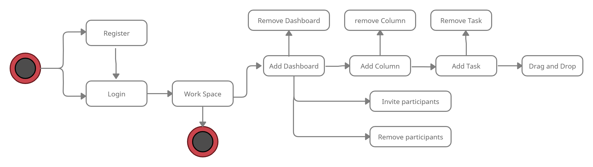

# WILLDO

#### WILLDO APP: is an online tool to manage project tasks in a simple and very visual way. It allows managing the tracking of errors and incidents of projects. ... the application can be used to manage and improve processes, thanks to its functions for organizing workflows.

 

 

 

# Functional Description

## The main features that this application allows a user

### 1 User can do:

* Login and register.
* Create dashboard.
* Edit and delete dashboard.
* Create column
* Edit and delete column.
* Create task.
* Edit and delete task.
* Task drag and drop.
* Invite participants.
* Remove participants.

## Use Cases

## Workflow

# Technical Description
 

## Blocks

## Data Model

# In progress

## Pending:

* Add Tests.
* Refactor.
* Edit profile.
* Protect routes.

